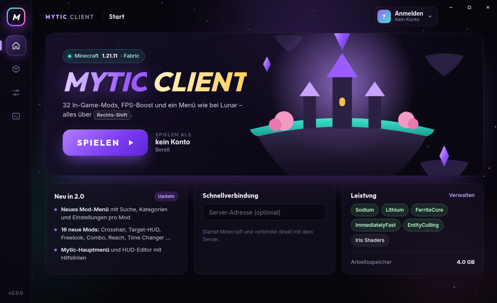
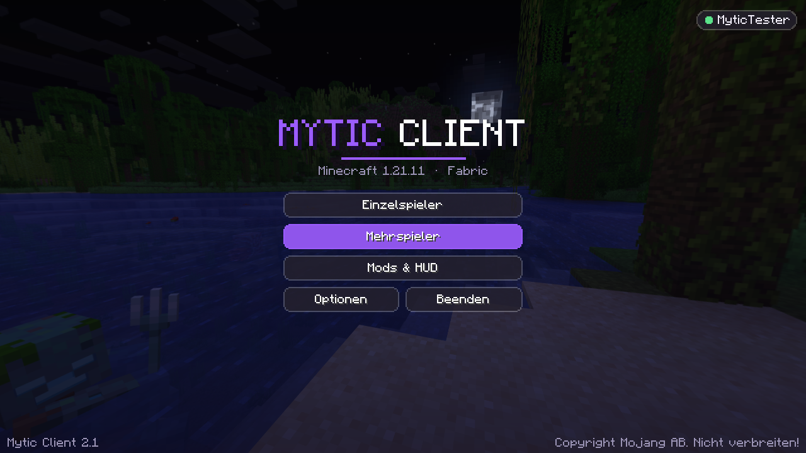
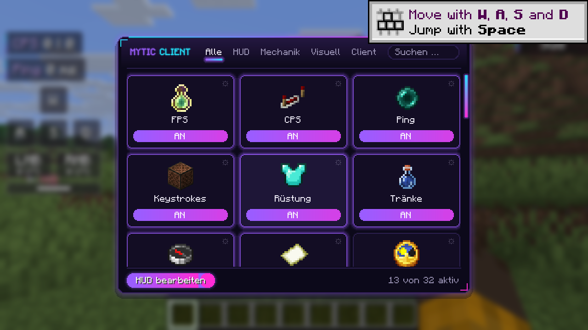
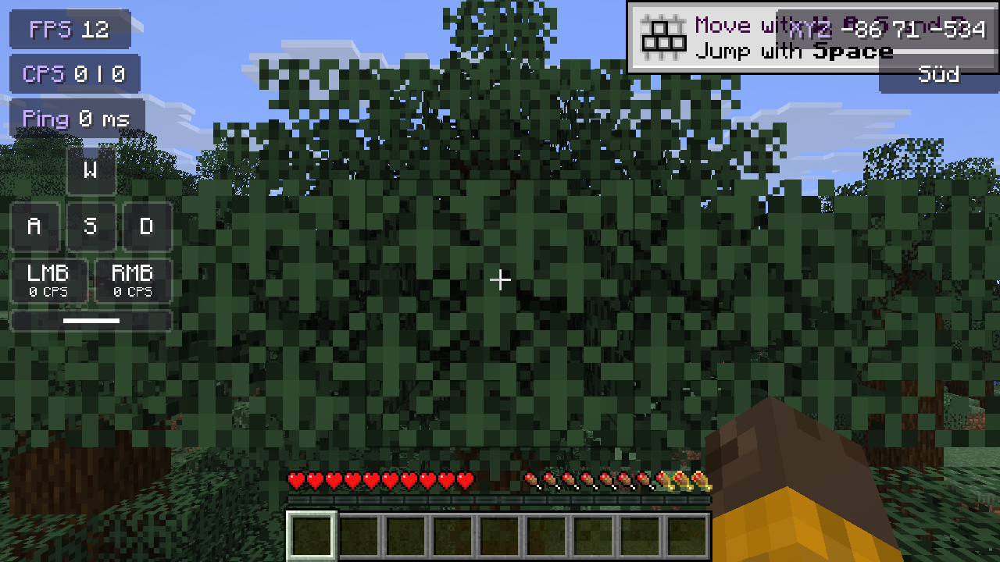
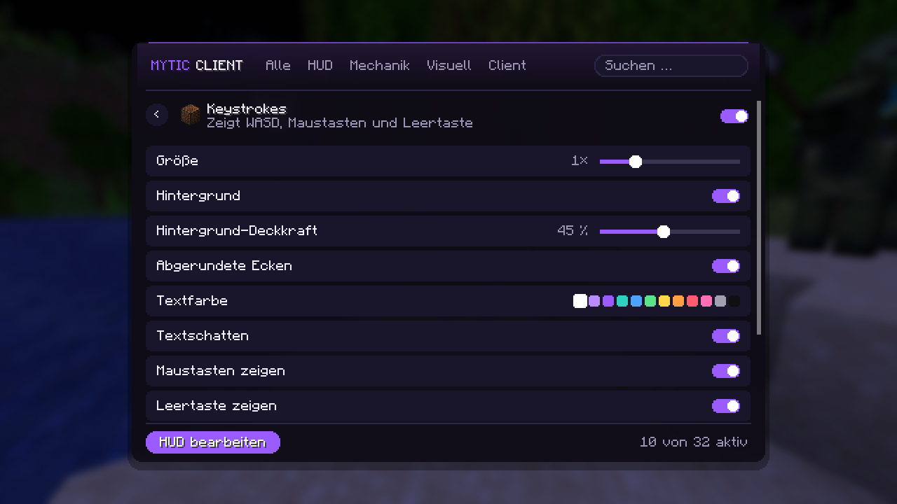
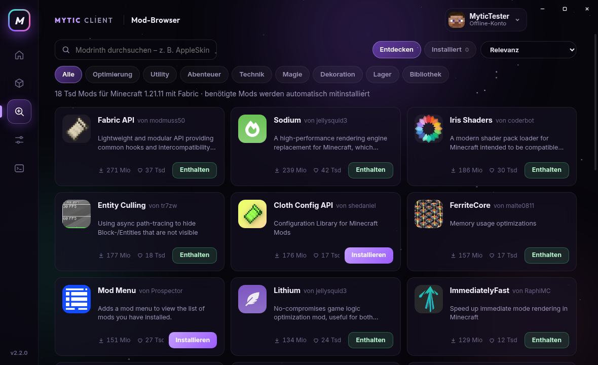
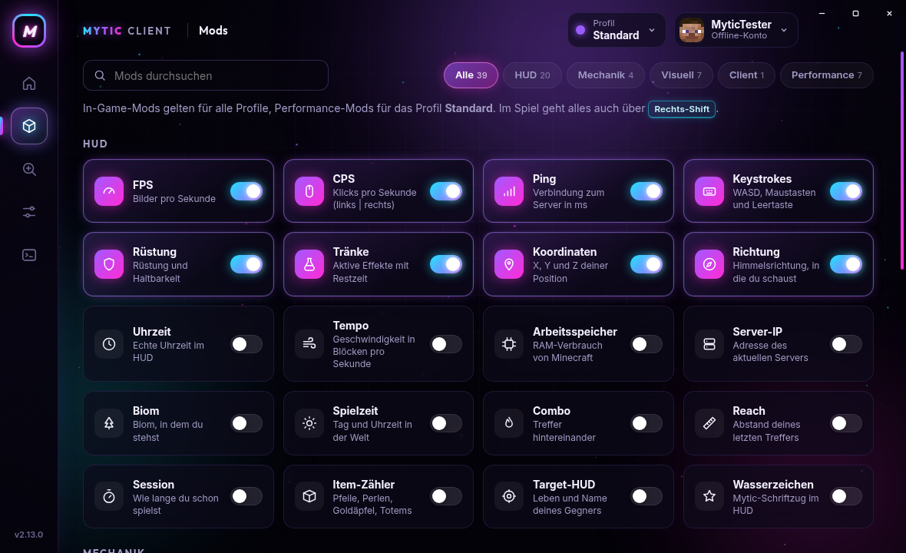

<div align="center">

# Mytic Client

**Ein eigener Minecraft-Client im Stil von Lunar: moderner Launcher, FPS-Boost und 32 In-Game-Mods.**

Minecraft 1.21 – 1.21.11 und 26.x · Fabric · Windows

**[⬇ Neueste Version herunterladen](https://github.com/xNikYox/Mytic-Client/releases/latest)**



</div>

---

## Funktionen

### Launcher

- **Ein Klick zum Spielen:** Java, Minecraft 1.21.11, Fabric und alle Mods werden automatisch heruntergeladen und aktuell gehalten. Spieler müssen nichts extra installieren.
- **Microsoft-Login:** Anmeldung mit dem echten Minecraft-Konto. Der Launcher prüft, ob das Konto Minecraft: Java Edition besitzt.
- **Mehrere Konten:** schnell zwischen Konten wechseln. Die Anmeldedaten werden mit der Verschlüsselung des Betriebssystems gespeichert.
- **Schnellverbindung:** direkt beim Start auf einen Server verbinden, zuletzt genutzte Server mit einem Klick.
- **Alle Versionen:** jedes Profil kann eine eigene Minecraft-Version nutzen, von 1.21 bis 1.21.11 und 26.x. Java 21 bzw. 25 lädt der Launcher automatisch, und der Mod-Browser zeigt nur Mods für die gewählte Version. Die Mytic-Ingame-Mods gibt es zurzeit für 1.21.11, weitere Versionen folgen.
- **Profile:** mehrere Profile, jedes mit eigenen Mods und eigener Auswahl an Performance-Mods, zum Beispiel „PvP“ und „Survival“. Welten, Server-Liste, Texturpakete und Einstellungen teilen sich alle Profile.
- **Mod-Browser:** Mods von Modrinth suchen und mit einem Klick installieren. Benötigte Mods kommen automatisch mit, eigene Mods lassen sich an- und ausschalten und werden bei jedem Start aktualisiert.
- **Mods verwalten:** alle In-Game- und Performance-Mods per Schalter an- und ausschalten, mit Suche und Kategorien.
- **Einstellungen:** RAM, Fenstergröße, Vollbild, Java-Argumente und eine Reparatur-Funktion.
- **Konsole:** lesbares Spiel-Log mit Filter für Warnungen und Fehler.
- **Automatische Updates:** Neue Versionen erkennt der Launcher selbst und installiert sie mit einem Klick. Konten und Einstellungen bleiben erhalten.
- **Eigener Ordner:** Alles liegt in `%APPDATA%\.myticclient` und bleibt getrennt von `.minecraft`.

### Im Spiel

Das Mod-Menü öffnest du mit **Rechts-Shift**. Es hat Suche, Kategorien, Mod-Karten mit Icons und eigene Einstellungen für jeden Mod. Dort findest du auch den **HUD-Editor**:
- Anzeigen mit der Maus verschieben, mit Hilfslinien und Einrasten.
- Mit dem Mausrad die Größe ändern.
- Mit Rechtsklick die Einstellungen der Anzeige öffnen.

| Kategorie | Mods |
|---|---|
| **HUD** | FPS, CPS, Ping, Keystrokes, Rüstung, Tränke, Koordinaten, Richtung, Uhrzeit, Tempo, Arbeitsspeicher, Server-IP, Biom, Spielzeit, Combo, Reach, Session, Item-Zähler, Target-HUD, Wasserzeichen |
| **Mechanik** | Zoom (C, Mausrad), Freelook (Alt), Toggle Sprint, Toggle Sneak |
| **Visuell** | Crosshair, Fullbright, Time Changer, Klares Wetter, No Hurt Cam, Scoreboard, Bossbar ausblenden |
| **Client** | Design (Akzentfarbe, Mytic-Hauptmenü, Menü-Hintergrund) |

Jede HUD-Anzeige hat diese Einstellungen: Größe, Hintergrund, Deckkraft, abgerundete Ecken, Textfarbe und Schatten. Viele haben zusätzlich eigene Optionen.

### Performance

Diese Mods kommen automatisch von [Modrinth](https://modrinth.com): **Sodium**, **Lithium**, **FerriteCore**, **ImmediatelyFast** und **EntityCulling**. **Iris** für Shader lässt sich zuschalten.

## Screenshots

**Im Spiel**

| Hauptmenü | Mod-Menü (Rechts-Shift) |
|---|---|
|  |  |
| **HUD** | **Einstellungen pro Mod** |
|  |  |

**Launcher**

| Mod-Browser | Mods |
|---|---|
|  |  |

## Download und Start

1. Lade unter [Releases](https://github.com/xNikYox/Mytic-Client/releases/latest) die neueste `MyticClient-<version>.exe` herunter.
2. Starte sie mit einem Doppelklick. Eine Installation ist nicht nötig.
   - Windows SmartScreen warnt bei unsignierten Dateien. Klicke dann auf **„Weitere Informationen“** → **„Trotzdem ausführen“**.
3. Klicke oben rechts auf **Anmelden** und melde dich mit Microsoft an.
4. Klicke auf **SPIELEN**. Der erste Start lädt etwa 1 GB herunter, danach geht es in Sekunden.

Neue Versionen musst du nicht selbst herunterladen. Der Launcher meldet sie und aktualisiert sich mit einem Klick.

**Systemvoraussetzungen:** Windows 10 oder 11 (64 Bit), Minecraft: Java Edition und etwa 1,5 GB freier Speicher.

## Projektaufbau

```
mod/        Fabric-Mod "myticclient" (Java 21): HUD, Mod-Menü, HUD-Editor, Hauptmenü, Mixins
launcher/   Electron-Launcher: Login, Download von Java/Minecraft/Fabric/Mods, Spielstart, Oberfläche
docs/       Anleitung für den Microsoft-Login, Screenshots
```

| Teil | Wichtige Dateien |
|---|---|
| Mod | `mod/src/main/java/de/myticlegacy/client/` mit den Ordnern `hud/` (Anzeigen), `module/` (Mechanik & Visuell), `gui/` (Menüs), `mixin/` und `setting/` |
| Launcher | `launcher/src/core/` (`auth.js`, `java.js`, `minecraft.js`, `download.js`), `launcher/src/main.js`, `launcher/src/renderer/` (Oberfläche) |

## Selbst bauen

Du brauchst Java 21 und Node.js 20 oder neuer.

```sh
# 1. Mod bauen und in den Launcher legen
cd mod
./gradlew build
cp build/libs/mytic-client-*.jar ../launcher/resources/mods/

# 2. Launcher starten, testen, bauen
cd ../launcher
npm install
npm start                          # Launcher zum Ausprobieren starten
npm test                           # Unit-Tests
LC_ALL=C.UTF-8 npm run dist:win    # dist/MyticClient-<version>.exe (portable) + .zip
```

Ein Setup-Installer mit Deinstallation (NSIS) lässt sich unter Windows mit `npx electron-builder --win nsis` bauen, unter Linux nur mit Wine.

## Microsoft-Login

Der Launcher nutzt eine eigene Azure-App, deren Client-ID in `launcher/resources/config.json` steht. Mojang muss diese ID für den Minecraft-Login freischalten. Wie das geht, steht in [docs/MICROSOFT-LOGIN.md](docs/MICROSOFT-LOGIN.md).

Zum Entwickeln gibt es Offline-Konten. Sie sind nur aktiv, wenn der Launcher aus dem Quellcode gestartet wird (`npm start`) oder `MYTIC_DEV=1` gesetzt ist, und in der veröffentlichten EXE abgeschaltet.

## Datenschutz

Es gibt keine eigenen Server, kein Tracking und keine Werbung. Anmeldedaten bleiben verschlüsselt auf deinem PC und gehen nur an Microsoft und Mojang. Details stehen in [docs/PRIVACY.md](docs/PRIVACY.md).

## Fair Play

Der Mytic Client enthält ausschließlich Komfort- und Anzeige-Mods, wie sie auch Lunar oder Badlion anbieten, und keine Cheats. Einige Server verbieten bestimmte Mods trotzdem. **Freelook** ist zum Beispiel auf manchen Servern nicht erlaubt. Prüfe im Zweifel die Regeln des Servers.

## Hinweis

Der Mytic Client ist kein offizielles Minecraft-Produkt und steht in keiner Verbindung zu Mojang oder Microsoft. Minecraft ist eine Marke von Mojang AB.
